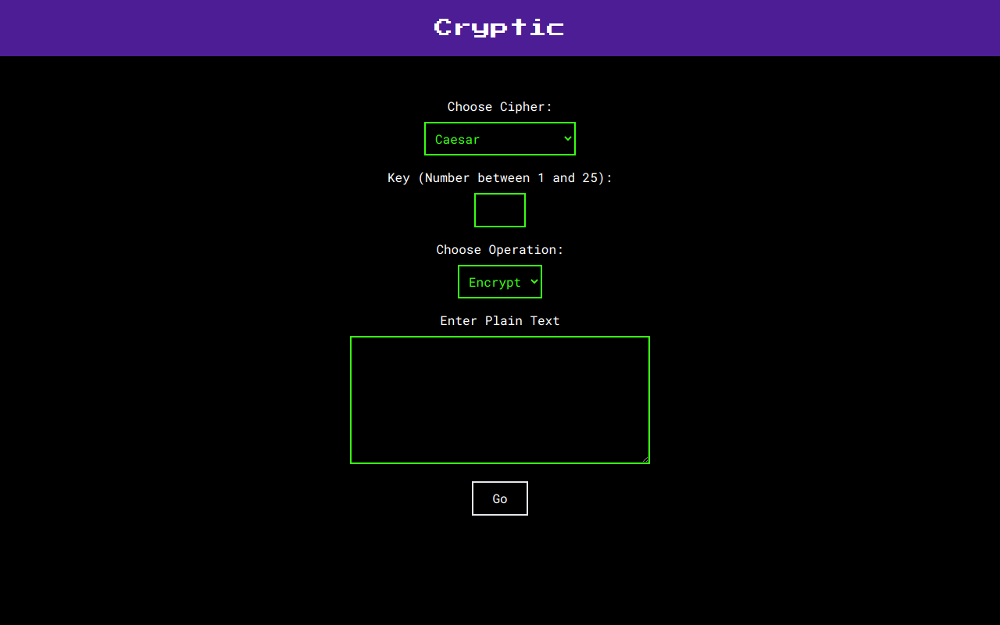

# Cryptic

Cryptic is a simple React App that allows you to encrypt and decrypt messages using symmetric substitution ciphers.

## Ciphers
* **Caesar**: Shifts text by a given number of letters (between 1 and 25).
* **Monosubstitution**: Uses a key to map two sets of alphabets, and perform encryption/decryption.
* **Vigenere**: A polysubstitution cipher that leverages caesar ciphers to encrypt/decrypt letters according to a key.

## Using the Application

The application is currently deployed on Vercel and can be found [here](https://cryptic-gdidcacm0-rounakbanik.vercel.app/)

In order to run the local, follow the steps below:
1. Clone this repository.
2. Install required packages using `npm install`.
3. Run a development server using `npm start`.
4. Create a production build using `npm run build`.
